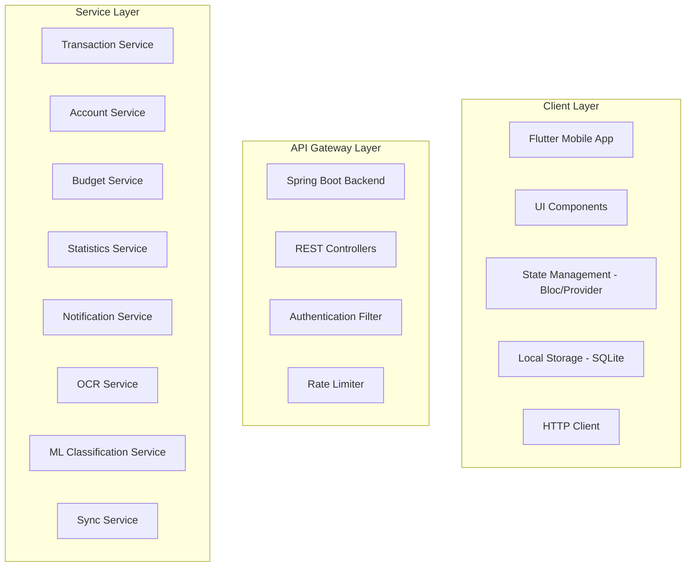
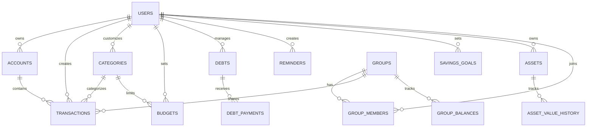

# Tài Liệu Thiết Kế - Ứng Dụng Quản Lý Chi Tiêu

## Tổng Quan

Ứng dụng Quản lý Chi tiêu là một hệ thống phân tán ba tầng (three-tier architecture) được xây dựng để giúp người dùng theo dõi, phân tích và lập kế hoạch tài chính cá nhân một cách toàn diện. Hệ thống bao gồm:

- **Frontend**: Ứng dụng di động Flutter hỗ trợ đa nền tảng (iOS, Android)
- **Backend**: RESTful API được xây dựng bằng Spring Boot với Java
- **Database**: PostgreSQL làm cơ sở dữ liệu quan hệ chính

Hệ thống cung cấp các tính năng từ cơ bản (quản lý giao dịch, nguồn tiền) đến nâng cao (phân loại tự động bằng ML, quét hóa đơn OCR, chia sẻ nhóm, đồng bộ đa thiết bị). Thiết kế tập trung vào hiệu năng, bảo mật, khả năng mở rộng và trải nghiệm người dùng mượt mà.

### Mục Tiêu Thiết Kế

1. **Hiệu năng cao**: Thời gian phản hồi API < 500ms, khởi động ứng dụng < 2s
2. **Bảo mật**: Mã hóa dữ liệu nhạy cảm, xác thực JWT, hỗ trợ sinh trắc học
3. **Khả năng mở rộng**: Hỗ trợ tối thiểu 100 request đồng thời, xử lý 10,000+ giao dịch
4. **Offline-first**: Hoạt động offline với đồng bộ tự động khi có mạng
5. **Trải nghiệm người dùng**: Giao diện trực quan, phản hồi nhanh, hỗ trợ đa ngôn ngữ

## Kiến Trúc Hệ Thống

### Kiến Trúc Tổng Thể

Hệ thống sử dụng kiến trúc Client-Server với các thành phần sau:



    subgraph "Data Layer"
        D1[(PostgreSQL)]
        D2[Redis Cache]
        D3[Cloud Storage - S3]
    end

    subgraph "External Services"
        E1[Email Service]
        E2[Push Notification Service]
        E3[OCR API - Tesseract/Google Vision]
    end

    A --> B
    B --> C1
    B --> C2
    B --> C3
    B --> C4
    C1 --> D1
    C2 --> D1
    C3 --> D1
    C4 --> D2
    C5 --> E1
    C5 --> E2
    C6 --> E3
    C8 --> D1
    A3 -.Offline Sync.-> C8

```

### Luồng Dữ Liệu Chính

1. **Luồng tạo giao dịch**:
   - Người dùng nhập thông tin giao dịch trên Flutter app
   - App lưu vào SQLite local (offline-first)
   - App gửi request đến Spring Boot API
   - API xác thực JWT token
   - Service xử lý logic nghiệp vụ (cập nhật số dư, phân loại tự động)
   - Lưu vào PostgreSQL
   - Trả về response và đồng bộ đến các thiết bị khác

2. **Luồng đồng bộ dữ liệu**:
   - Sync Service định kỳ kiểm tra thay đổi
   - Sử dụng timestamp và version để phát hiện conflict
   - Áp dụng chiến lược "last-write-wins" với timestamp
   - Push notification đến các thiết bị cần cập nhật

3. **Luồng thống kê**:
   - Request thống kê từ app
   - Kiểm tra Redis cache trước
   - Nếu cache miss, query PostgreSQL với các index tối ưu
   - Tính toán và lưu vào cache (TTL 5 phút)
   - Trả về kết quả

## Các Thành Phần và Giao Diện

### 1. Flutter Mobile App

#### Cấu trúc thư mục
```

```
lib/
├── core/
│   ├── constants/
│   ├── utils/
│   ├── network/
│   └── storage/
├── data/
│   ├── models/
│   ├── repositories/
│   └── datasources/
│       ├── local/
│       └── remote/
├── domain/
│   ├── entities/
│   ├── repositories/
│   └── usecases/
├── presentation/
│   ├── screens/
│   ├── widgets/
│   └── bloc/
└── main.dart
```

#### Các thành phần chính

**State Management**: Sử dụng Flutter Bloc pattern

- TransactionBloc: Quản lý state giao dịch
- AccountBloc: Quản lý nguồn tiền
- BudgetBloc: Quản lý ngân sách
- StatisticsBloc: Quản lý thống kê
- SyncBloc: Quản lý đồng bộ

**Local Storage**: SQLite với sqflite package

- Lưu trữ offline data
- Cache cho hiệu năng
- Queue cho pending sync operations

**Network Layer**: Dio HTTP client

- Interceptor cho JWT authentication
- Retry logic cho failed requests
- Request/response logging

**Security**:

- Flutter Secure Storage cho sensitive data
- Local Authentication cho biometric
- Certificate pinning cho HTTPS

### 2. Spring Boot Backend

#### Cấu trúc package

```
com.expensemanager/
├── config/
│   ├── SecurityConfig.java
│   ├── DatabaseConfig.java
│   └── RedisConfig.java
├── controller/
│   ├── TransactionController.java
│   ├── AccountController.java
│   ├── BudgetController.java
│   ├── StatisticsController.java
│   ├── GroupController.java
│   └── AuthController.java
├── service/
│   ├── TransactionService.java
│   ├── AccountService.java
│   ├── BudgetService.java
│   ├── NotificationService.java
│   ├── OCRService.java
│   ├── MLClassificationService.java
│   └── SyncService.java
├── repository/
│   ├── TransactionRepository.java
│   ├── AccountRepository.java
│   └── UserRepository.java
├── model/
│   ├── entity/
│   └── dto/
├── security/
│   ├── JwtTokenProvider.java
│   └── JwtAuthenticationFilter.java
└── exception/
    └── GlobalExceptionHandler.java
```

#### Các service chính

**TransactionService**:

- CRUD operations cho giao dịch
- Tự động cập nhật số dư nguồn tiền
- Tích hợp ML classification
- Xử lý soft delete

**AccountService**:

- Quản lý nguồn tiền (CRUD operations)
- Đảm bảo consistency khi cập nhật số dư
- Sử dụng pessimistic locking cho concurrent updates
- Tính toán tiền lãi dự kiến cho tài khoản tiết kiệm:
  - Công thức: `expected_interest = current_balance * (interest_rate / 100) * (days_until_withdrawal / 365)`
  - Scheduled job chạy hàng ngày để cập nhật tiền lãi dự kiến
- Quản lý thẻ tín dụng:
  - Tính số tiền khả dụng: `available_credit = credit_limit - current_debt`
  - Cập nhật current_debt khi có giao dịch chi tiêu bằng thẻ tín dụng
  - Cập nhật current_debt khi thanh toán dư nợ
- Scheduled job kiểm tra ngày đến hạn thanh toán thẻ tín dụng:
  - Gửi cảnh báo trước 3 ngày (Notification Service)
  - Gửi nhắc nhở vào đúng ngày đến hạn
- Thống kê theo nguồn tiền:
  - Tính tổng thu, tổng chi theo account_id
  - Tạo biểu đồ thu chi theo thời gian cho từng nguồn tiền

**BudgetService**:

- Tính toán phần trăm sử dụng ngân sách
- Trigger notification khi vượt ngưỡng
- Scheduled job kiểm tra định kỳ

**SyncService**:

- Conflict resolution với timestamp
- Batch sync cho hiệu năng
- WebSocket cho real-time updates (optional)

**OCRService**:

- Tích hợp Tesseract hoặc Google Vision API
- Pre-processing ảnh (resize, enhance)
- Post-processing kết quả (extract amount, date, merchant)

**MLClassificationService**:

- Train model từ lịch sử người dùng
- Naive Bayes hoặc Random Forest classifier
- Per-user model storage
- Confidence threshold cho auto-apply

### Quản Lý Nguồn Tiền Nâng Cao

#### Tài Khoản Tiết Kiệm (Savings Account)

**Mô tả**: Tài khoản tiết kiệm cho phép người dùng theo dõi tiền gửi có lãi suất và tính toán lợi nhuận dự kiến.

**Thuộc tính đặc biệt**:

- `interest_rate`: Lãi suất % năm (ví dụ: 5.5 cho 5.5%/năm)
- `expected_withdrawal_date`: Ngày dự kiến rút tiền
- `current_balance`: Số dư hiện tại

**Logic tính toán lãi**:

```java
public BigDecimal calculateExpectedInterest(Account savingsAccount) {
    if (savingsAccount.getType() != AccountType.SAVINGS_ACCOUNT) {
        throw new IllegalArgumentException("Account must be savings type");
    }

    BigDecimal currentBalance = savingsAccount.getCurrentBalance();
    BigDecimal interestRate = savingsAccount.getInterestRate();
    LocalDate withdrawalDate = savingsAccount.getExpectedWithdrawalDate();

    if (withdrawalDate == null || withdrawalDate.isBefore(LocalDate.now())) {
        return BigDecimal.ZERO;
    }

    long daysUntilWithdrawal = ChronoUnit.DAYS.between(LocalDate.now(), withdrawalDate);

    // Công thức: lãi = số dư * (lãi suất / 100) * (số ngày / 365)
    BigDecimal expectedInterest = currentBalance
        .multiply(interestRate.divide(new BigDecimal("100"), 10, RoundingMode.HALF_UP))
        .multiply(new BigDecimal(daysUntilWithdrawal))
        .divide(new BigDecimal("365"), 2, RoundingMode.HALF_UP);

    return expectedInterest;
}
```

**Scheduled Job**:

```java
@Scheduled(cron = "0 0 1 * * *") // Chạy lúc 1:00 AM mỗi ngày
public void updateSavingsAccountInterest() {
    List<Account> savingsAccounts = accountRepository.findByType(AccountType.SAVINGS_ACCOUNT);

    for (Account account : savingsAccounts) {
        BigDecimal expectedInterest = calculateExpectedInterest(account);
        // Lưu vào cache hoặc field tạm để hiển thị
        redisTemplate.opsForValue().set(
            "savings:interest:" + account.getId(),
            expectedInterest.toString(),
            Duration.ofDays(1)
        );
    }
}
```

**API Response Example**:

```json
{
  "id": 123,
  "name": "Tài khoản tiết kiệm VCB",
  "type": "savings_account",
  "current_balance": 50000000,
  "interest_rate": 5.5,
  "expected_withdrawal_date": "2024-12-31",
  "expected_interest": 1375000,
  "total_expected_amount": 51375000
}
```

#### Thẻ Tín Dụng (Credit Card)

**Mô tả**: Thẻ tín dụng cho phép người dùng theo dõi hạn mức, dư nợ và nhận cảnh báo thanh toán.

**Thuộc tính đặc biệt**:

- `credit_limit`: Hạn mức tín dụng tối đa
- `current_debt`: Dư nợ hiện tại
- `payment_due_date`: Ngày đến hạn thanh toán
- `available_credit`: Số tiền khả dụng (computed field)

**Logic quản lý dư nợ**:

```java
public BigDecimal getAvailableCredit(Account creditCard) {
    if (creditCard.getType() != AccountType.CREDIT_CARD) {
        throw new IllegalArgumentException("Account must be credit card type");
    }

    BigDecimal creditLimit = creditCard.getCreditLimit();
    BigDecimal currentDebt = creditCard.getCurrentDebt();

    return creditLimit.subtract(currentDebt);
}

public void processExpenseTransaction(Transaction transaction) {
    Account account = transaction.getAccount();

    if (account.getType() == AccountType.CREDIT_CARD) {
        // Với thẻ tín dụng, tăng dư nợ thay vì giảm số dư
        BigDecimal newDebt = account.getCurrentDebt().add(transaction.getAmount());

        if (newDebt.compareTo(account.getCreditLimit()) > 0) {
            throw new InsufficientCreditException("Vượt quá hạn mức tín dụng");
        }

        account.setCurrentDebt(newDebt);
    } else {
        // Với các loại tài khoản khác, giảm số dư
        BigDecimal newBalance = account.getCurrentBalance().subtract(transaction.getAmount());

        if (newBalance.compareTo(BigDecimal.ZERO) < 0) {
            throw new InsufficientBalanceException("Số dư không đủ");
        }

        account.setCurrentBalance(newBalance);
    }

    accountRepository.save(account);
}

public void payDebt(Long accountId, BigDecimal paymentAmount) {
    Account creditCard = accountRepository.findById(accountId)
        .orElseThrow(() -> new AccountNotFoundException("Account not found"));

    if (creditCard.getType() != AccountType.CREDIT_CARD) {
        throw new IllegalArgumentException("Account must be credit card type");
    }

    BigDecimal currentDebt = creditCard.getCurrentDebt();

    if (paymentAmount.compareTo(currentDebt) > 0) {
        throw new IllegalArgumentException("Số tiền thanh toán vượt quá dư nợ");
    }

    BigDecimal newDebt = currentDebt.subtract(paymentAmount);
    creditCard.setCurrentDebt(newDebt);

    accountRepository.save(creditCard);

    // Tạo giao dịch thanh toán
    Transaction paymentTransaction = new Transaction();
    paymentTransaction.setAccount(creditCard);
    paymentTransaction.setAmount(paymentAmount);
    paymentTransaction.setType(TransactionType.EXPENSE);
    paymentTransaction.setNote("Thanh toán dư nợ thẻ tín dụng");
    transactionRepository.save(paymentTransaction);
}
```

**Scheduled Job - Cảnh báo thanh toán**:

```java
@Scheduled(cron = "0 0 9 * * *") // Chạy lúc 9:00 AM mỗi ngày
public void checkCreditCardPaymentDue() {
    LocalDate today = LocalDate.now();
    LocalDate threeDaysLater = today.plusDays(3);

    // Cảnh báo trước 3 ngày
    List<Account> creditCardsWarning = accountRepository
        .findByTypeAndPaymentDueDateBetween(
            AccountType.CREDIT_CARD,
            today,
            threeDaysLater
        );

    for (Account creditCard : creditCardsWarning) {
        long daysUntilDue = ChronoUnit.DAYS.between(today, creditCard.getPaymentDueDate());

        if (daysUntilDue == 3) {
            notificationService.sendPaymentWarning(
                creditCard.getUserId(),
                "Thẻ tín dụng " + creditCard.getName() + " sẽ đến hạn thanh toán trong 3 ngày",
                creditCard.getCurrentDebt()
            );
        } else if (daysUntilDue == 0) {
            notificationService.sendPaymentReminder(
                creditCard.getUserId(),
                "Hôm nay là ngày đến hạn thanh toán thẻ tín dụng " + creditCard.getName(),
                creditCard.getCurrentDebt()
            );
        }
    }
}
```

**API Response Example**:

```json
{
  "id": 456,
  "name": "Thẻ tín dụng Techcombank",
  "type": "credit_card",
  "credit_limit": 30000000,
  "current_debt": 5000000,
  "available_credit": 25000000,
  "payment_due_date": "2024-02-15",
  "days_until_due": 3,
  "utilization_rate": 16.67
}
```

#### Thống Kê Theo Nguồn Tiền

**Endpoint**: `GET /api/accounts/{id}/statistics`

**Query Parameters**:

- `start_date`: Ngày bắt đầu (format: YYYY-MM-DD)
- `end_date`: Ngày kết thúc (format: YYYY-MM-DD)
- `period`: Chu kỳ thống kê (day, week, month, year)

**Logic thống kê**:

```java
public AccountStatistics getAccountStatistics(Long accountId, LocalDate startDate, LocalDate endDate) {
    Account account = accountRepository.findById(accountId)
        .orElseThrow(() -> new AccountNotFoundException("Account not found"));

    // Lấy tất cả giao dịch trong khoảng thời gian
    List<Transaction> transactions = transactionRepository
        .findByAccountIdAndTransactionDateBetween(accountId, startDate, endDate);

    // Tính tổng thu
    BigDecimal totalIncome = transactions.stream()
        .filter(t -> t.getType() == TransactionType.INCOME)
        .map(Transaction::getAmount)
        .reduce(BigDecimal.ZERO, BigDecimal::add);

    // Tính tổng chi
    BigDecimal totalExpense = transactions.stream()
        .filter(t -> t.getType() == TransactionType.EXPENSE)
        .map(Transaction::getAmount)
        .reduce(BigDecimal.ZERO, BigDecimal::add);

    // Tính số dư ròng
    BigDecimal netBalance = totalIncome.subtract(totalExpense);

    // Tạo biểu đồ theo thời gian
    Map<LocalDate, BigDecimal> incomeChart = new TreeMap<>();
    Map<LocalDate, BigDecimal> expenseChart = new TreeMap<>();

    for (Transaction transaction : transactions) {
        LocalDate date = transaction.getTransactionDate().toLocalDate();

        if (transaction.getType() == TransactionType.INCOME) {
            incomeChart.merge(date, transaction.getAmount(), BigDecimal::add);
        } else {
            expenseChart.merge(date, transaction.getAmount(), BigDecimal::add);
        }
    }

    return AccountStatistics.builder()
        .accountId(accountId)
        .accountName(account.getName())
        .totalIncome(totalIncome)
        .totalExpense(totalExpense)
        .netBalance(netBalance)
        .transactionCount(transactions.size())
        .incomeChart(incomeChart)
        .expenseChart(expenseChart)
        .startDate(startDate)
        .endDate(endDate)
        .build();
}
```

**API Response Example**:

```json
{
  "account_id": 123,
  "account_name": "Ví tiền mặt",
  "start_date": "2024-01-01",
  "end_date": "2024-01-31",
  "total_income": 15000000,
  "total_expense": 8500000,
  "net_balance": 6500000,
  "transaction_count": 45,
  "income_chart": {
    "2024-01-05": 5000000,
    "2024-01-15": 10000000
  },
  "expense_chart": {
    "2024-01-03": 500000,
    "2024-01-10": 2000000,
    "2024-01-20": 6000000
  }
}
```

### 3. API Endpoints

#### Authentication

```
POST   /api/auth/register          - Đăng ký tài khoản
POST   /api/auth/login             - Đăng nhập
POST   /api/auth/refresh           - Refresh JWT token
POST   /api/auth/forgot-password   - Quên mật khẩu
POST   /api/auth/reset-password    - Đặt lại mật khẩu
```

#### Transactions

```
GET    /api/transactions           - Lấy danh sách giao dịch (pagination, filter)
GET    /api/transactions/{id}      - Lấy chi tiết giao dịch
POST   /api/transactions           - Tạo giao dịch mới
PUT    /api/transactions/{id}      - Cập nhật giao dịch
DELETE /api/transactions/{id}      - Xóa giao dịch (soft delete)
GET    /api/transactions/search    - Tìm kiếm giao dịch
POST   /api/transactions/bulk      - Tạo nhiều giao dịch
```

#### Accounts (Nguồn tiền)

```
GET    /api/accounts                      - Lấy danh sách nguồn tiền
GET    /api/accounts/{id}                 - Lấy chi tiết nguồn tiền
POST   /api/accounts                      - Tạo nguồn tiền mới
PUT    /api/accounts/{id}                 - Cập nhật nguồn tiền
DELETE /api/accounts/{id}                 - Xóa nguồn tiền
GET    /api/accounts/balance              - Lấy tổng số dư
GET    /api/accounts/{id}/transactions    - Lấy giao dịch theo nguồn tiền (pagination, filter)
GET    /api/accounts/{id}/statistics      - Lấy thống kê thu chi theo nguồn tiền
GET    /api/accounts/savings/interest     - Tính toán lãi suất cho tất cả tài khoản tiết kiệm
GET    /api/accounts/credit-cards/alerts  - Lấy cảnh báo cho tất cả thẻ tín dụng
POST   /api/accounts/{id}/pay-debt        - Thanh toán dư nợ thẻ tín dụng
```

#### Categories (Danh mục)

```
GET    /api/categories             - Lấy danh sách danh mục
POST   /api/categories             - Tạo danh mục tùy chỉnh
PUT    /api/categories/{id}        - Cập nhật danh mục
DELETE /api/categories/{id}        - Xóa danh mục
PUT    /api/categories/reorder     - Sắp xếp thứ tự danh mục
```

#### Budgets (Ngân sách)

```
GET    /api/budgets                - Lấy danh sách ngân sách
GET    /api/budgets/{id}           - Lấy chi tiết ngân sách
POST   /api/budgets                - Tạo ngân sách mới
PUT    /api/budgets/{id}           - Cập nhật ngân sách
DELETE /api/budgets/{id}           - Xóa ngân sách
GET    /api/budgets/{id}/progress  - Lấy tiến độ sử dụng ngân sách
```

#### Statistics (Thống kê)

```
GET    /api/statistics/overview    - Tổng quan thu chi
GET    /api/statistics/by-category - Thống kê theo danh mục
GET    /api/statistics/by-period   - Thống kê theo kỳ
GET    /api/statistics/trends      - Xu hướng chi tiêu
GET    /api/statistics/compare     - So sánh giữa các kỳ
```

#### Debts (Nợ)

```
GET    /api/debts                  - Lấy danh sách khoản nợ
POST   /api/debts                  - Tạo khoản nợ mới
PUT    /api/debts/{id}             - Cập nhật khoản nợ
DELETE /api/debts/{id}             - Xóa khoản nợ
POST   /api/debts/{id}/payment     - Thanh toán một phần
```

#### Reminders (Nhắc nhở)

```
GET    /api/reminders              - Lấy danh sách nhắc nhở
POST   /api/reminders              - Tạo nhắc nhở mới
PUT    /api/reminders/{id}         - Cập nhật nhắc nhở
DELETE /api/reminders/{id}         - Xóa nhắc nhở
POST   /api/reminders/{id}/complete - Đánh dấu hoàn thành
```

#### Groups (Nhóm)

```
GET    /api/groups                 - Lấy danh sách nhóm
POST   /api/groups                 - Tạo nhóm mới
GET    /api/groups/{id}            - Lấy chi tiết nhóm
PUT    /api/groups/{id}            - Cập nhật nhóm
DELETE /api/groups/{id}            - Xóa nhóm
POST   /api/groups/{id}/invite     - Mời thành viên
POST   /api/groups/{id}/join       - Tham gia nhóm
DELETE /api/groups/{id}/leave      - Rời khỏi nhóm
GET    /api/groups/{id}/balance    - Lấy số dư nhóm
POST   /api/groups/{id}/settle     - Thanh toán trong nhóm
```

#### OCR

```
POST   /api/ocr/scan               - Quét hóa đơn
GET    /api/ocr/history            - Lịch sử quét
```

#### Reports (Báo cáo)

```
POST   /api/reports/generate       - Tạo báo cáo
GET    /api/reports                - Lấy danh sách báo cáo
GET    /api/reports/{id}/download  - Tải xuống báo cáo
```

#### Savings Goals (Mục tiêu tiết kiệm)

```
GET    /api/savings-goals          - Lấy danh sách mục tiêu
POST   /api/savings-goals          - Tạo mục tiêu mới
PUT    /api/savings-goals/{id}     - Cập nhật mục tiêu
DELETE /api/savings-goals/{id}     - Xóa mục tiêu
POST   /api/savings-goals/{id}/contribute - Đóng góp vào mục tiêu
POST   /api/savings-goals/{id}/withdraw   - Rút tiền từ mục tiêu
```

#### Assets (Tài sản)

```
GET    /api/assets                 - Lấy danh sách tài sản
POST   /api/assets                 - Tạo tài sản mới
PUT    /api/assets/{id}            - Cập nhật tài sản
DELETE /api/assets/{id}            - Xóa tài sản
GET    /api/assets/net-worth       - Tính tổng tài sản ròng
```

#### Sync

```
POST   /api/sync/pull              - Kéo dữ liệu mới nhất
POST   /api/sync/push              - Đẩy thay đổi local
GET    /api/sync/status            - Kiểm tra trạng thái đồng bộ
```

#### Backup

```
POST   /api/backup/create          - Tạo bản sao lưu
GET    /api/backup/list            - Lấy danh sách bản sao lưu
POST   /api/backup/restore         - Khôi phục từ bản sao lưu
```

## Mô Hình Dữ Liệu

### Database Schema

#### Users Table

```sql
CREATE TABLE users (
    id BIGSERIAL PRIMARY KEY,
    email VARCHAR(255) UNIQUE NOT NULL,
    password_hash VARCHAR(255) NOT NULL,
    full_name VARCHAR(255),
    phone VARCHAR(20),
    avatar_url TEXT,
    language VARCHAR(10) DEFAULT 'vi',
    currency VARCHAR(10) DEFAULT 'VND',
    theme VARCHAR(20) DEFAULT 'light',
    week_start_day VARCHAR(10) DEFAULT 'monday',
    date_format VARCHAR(20) DEFAULT 'DD/MM/YYYY',
    biometric_enabled BOOLEAN DEFAULT FALSE,
    auto_backup_enabled BOOLEAN DEFAULT FALSE,
    auto_classification_enabled BOOLEAN DEFAULT TRUE,
    created_at TIMESTAMP DEFAULT CURRENT_TIMESTAMP,
    updated_at TIMESTAMP DEFAULT CURRENT_TIMESTAMP,
    deleted_at TIMESTAMP,
    version INTEGER DEFAULT 1
);

CREATE INDEX idx_users_email ON users(email);
CREATE INDEX idx_users_deleted_at ON users(deleted_at);
```

#### Accounts Table (Nguồn tiền)

```sql
CREATE TABLE accounts (
    id BIGSERIAL PRIMARY KEY,
    user_id BIGINT NOT NULL REFERENCES users(id),
    name VARCHAR(255) NOT NULL,
    type VARCHAR(50) NOT NULL, -- 'wallet', 'bank', 'savings_account', 'credit_card'
    initial_balance DECIMAL(15, 2) DEFAULT 0,
    current_balance DECIMAL(15, 2) DEFAULT 0,
    icon VARCHAR(100),
    color VARCHAR(20),
    display_order INTEGER DEFAULT 0,
    -- Savings Account fields
    interest_rate DECIMAL(5, 2), -- Lãi suất % năm (cho savings_account)
    expected_withdrawal_date DATE, -- Ngày rút dự kiến (cho savings_account)
    -- Credit Card fields
    credit_limit DECIMAL(15, 2), -- Hạn mức tín dụng (cho credit_card)
    current_debt DECIMAL(15, 2) DEFAULT 0, -- Dư nợ hiện tại (cho credit_card)
    payment_due_date DATE, -- Ngày đến hạn thanh toán (cho credit_card)
    created_at TIMESTAMP DEFAULT CURRENT_TIMESTAMP,
    updated_at TIMESTAMP DEFAULT CURRENT_TIMESTAMP,
    deleted_at TIMESTAMP,
    version INTEGER DEFAULT 1
);

CREATE INDEX idx_accounts_user_id ON accounts(user_id);
CREATE INDEX idx_accounts_type ON accounts(type);
CREATE INDEX idx_accounts_payment_due_date ON accounts(payment_due_date);
CREATE INDEX idx_accounts_deleted_at ON accounts(deleted_at);
```

#### Categories Table (Danh mục)

```sql
CREATE TABLE categories (
    id BIGSERIAL PRIMARY KEY,
    user_id BIGINT REFERENCES users(id), -- NULL for default categories
    name VARCHAR(255) NOT NULL,
    type VARCHAR(20) NOT NULL, -- 'income', 'expense'
    icon VARCHAR(100),
    color VARCHAR(20),
    is_default BOOLEAN DEFAULT FALSE,
    display_order INTEGER DEFAULT 0,
    created_at TIMESTAMP DEFAULT CURRENT_TIMESTAMP,
    updated_at TIMESTAMP DEFAULT CURRENT_TIMESTAMP,
    deleted_at TIMESTAMP,
    version INTEGER DEFAULT 1
);

CREATE INDEX idx_categories_user_id ON categories(user_id);
CREATE INDEX idx_categories_type ON categories(type);
CREATE INDEX idx_categories_deleted_at ON categories(deleted_at);
```

#### Transactions Table (Giao dịch)

```sql
CREATE TABLE transactions (
    id BIGSERIAL PRIMARY KEY,
    user_id BIGINT NOT NULL REFERENCES users(id),
    account_id BIGINT NOT NULL REFERENCES accounts(id),
    category_id BIGINT NOT NULL REFERENCES categories(id),
    amount DECIMAL(15, 2) NOT NULL,
    type VARCHAR(20) NOT NULL, -- 'income', 'expense'
    transaction_date TIMESTAMP NOT NULL,
    note TEXT,
    image_url TEXT,
    group_id BIGINT REFERENCES groups(id),
    created_at TIMESTAMP DEFAULT CURRENT_TIMESTAMP,
    updated_at TIMESTAMP DEFAULT CURRENT_TIMESTAMP,
    deleted_at TIMESTAMP,
    version INTEGER DEFAULT 1
);

CREATE INDEX idx_transactions_user_id ON transactions(user_id);
CREATE INDEX idx_transactions_account_id ON transactions(account_id);
CREATE INDEX idx_transactions_category_id ON transactions(category_id);
CREATE INDEX idx_transactions_date ON transactions(transaction_date);
CREATE INDEX idx_transactions_type ON transactions(type);
CREATE INDEX idx_transactions_deleted_at ON transactions(deleted_at);
CREATE INDEX idx_transactions_group_id ON transactions(group_id);
```

#### Budgets Table (Ngân sách)

```sql
CREATE TABLE budgets (
    id BIGSERIAL PRIMARY KEY,
    user_id BIGINT NOT NULL REFERENCES users(id),
    category_id BIGINT NOT NULL REFERENCES categories(id),
    amount DECIMAL(15, 2) NOT NULL,
    period_type VARCHAR(20) NOT NULL, -- 'daily', 'weekly', 'monthly', 'yearly'
    start_date DATE NOT NULL,
    end_date DATE NOT NULL,
    created_at TIMESTAMP DEFAULT CURRENT_TIMESTAMP,
    updated_at TIMESTAMP DEFAULT CURRENT_TIMESTAMP,
    deleted_at TIMESTAMP,
    version INTEGER DEFAULT 1
);

CREATE INDEX idx_budgets_user_id ON budgets(user_id);
CREATE INDEX idx_budgets_category_id ON budgets(category_id);
CREATE INDEX idx_budgets_period ON budgets(start_date, end_date);
CREATE INDEX idx_budgets_deleted_at ON budgets(deleted_at);
```

#### Debts Table (Nợ)

```sql
CREATE TABLE debts (
    id BIGSERIAL PRIMARY KEY,
    user_id BIGINT NOT NULL REFERENCES users(id),
    type VARCHAR(20) NOT NULL, -- 'payable', 'receivable'
    person_name VARCHAR(255) NOT NULL,
    total_amount DECIMAL(15, 2) NOT NULL,
    remaining_amount DECIMAL(15, 2) NOT NULL,
    interest_rate DECIMAL(5, 2) DEFAULT 0,
    due_date DATE,
    status VARCHAR(20) DEFAULT 'active', -- 'active', 'completed'
    note TEXT,
    created_at TIMESTAMP DEFAULT CURRENT_TIMESTAMP,
    updated_at TIMESTAMP DEFAULT CURRENT_TIMESTAMP,
    deleted_at TIMESTAMP,
    version INTEGER DEFAULT 1
);

CREATE INDEX idx_debts_user_id ON debts(user_id);
CREATE INDEX idx_debts_type ON debts(type);
CREATE INDEX idx_debts_status ON debts(status);
CREATE INDEX idx_debts_due_date ON debts(due_date);
CREATE INDEX idx_debts_deleted_at ON debts(deleted_at);
```

#### Debt Payments Table

```sql
CREATE TABLE debt_payments (
    id BIGSERIAL PRIMARY KEY,
    debt_id BIGINT NOT NULL REFERENCES debts(id),
    amount DECIMAL(15, 2) NOT NULL,
    payment_date TIMESTAMP NOT NULL,
    note TEXT,
    created_at TIMESTAMP DEFAULT CURRENT_TIMESTAMP
);

CREATE INDEX idx_debt_payments_debt_id ON debt_payments(debt_id);
```

#### Reminders Table (Nhắc nhở)

```sql
CREATE TABLE reminders (
    id BIGSERIAL PRIMARY KEY,
    user_id BIGINT NOT NULL REFERENCES users(id),
    title VARCHAR(255) NOT NULL,
    amount DECIMAL(15, 2),
    frequency VARCHAR(20) NOT NULL, -- 'daily', 'weekly', 'monthly', 'yearly'
    reminder_time TIME NOT NULL,
    next_reminder_date DATE NOT NULL,
    is_active BOOLEAN DEFAULT TRUE,
    created_at TIMESTAMP DEFAULT CURRENT_TIMESTAMP,
    updated_at TIMESTAMP DEFAULT CURRENT_TIMESTAMP,
    deleted_at TIMESTAMP,
    version INTEGER DEFAULT 1
);

CREATE INDEX idx_reminders_user_id ON reminders(user_id);
CREATE INDEX idx_reminders_next_date ON reminders(next_reminder_date);
CREATE INDEX idx_reminders_active ON reminders(is_active);
CREATE INDEX idx_reminders_deleted_at ON reminders(deleted_at);
```

#### Groups Table (Nhóm)

```sql
CREATE TABLE groups (
    id BIGSERIAL PRIMARY KEY,
    name VARCHAR(255) NOT NULL,
    description TEXT,
    invite_code VARCHAR(50) UNIQUE,
    created_by BIGINT NOT NULL REFERENCES users(id),
    created_at TIMESTAMP DEFAULT CURRENT_TIMESTAMP,
    updated_at TIMESTAMP DEFAULT CURRENT_TIMESTAMP,
    deleted_at TIMESTAMP,
    version INTEGER DEFAULT 1
);

CREATE INDEX idx_groups_invite_code ON groups(invite_code);
CREATE INDEX idx_groups_created_by ON groups(created_by);
CREATE INDEX idx_groups_deleted_at ON groups(deleted_at);
```

#### Group Members Table

```sql
CREATE TABLE group_members (
    id BIGSERIAL PRIMARY KEY,
    group_id BIGINT NOT NULL REFERENCES groups(id),
    user_id BIGINT NOT NULL REFERENCES users(id),
    role VARCHAR(20) DEFAULT 'member', -- 'admin', 'member'
    joined_at TIMESTAMP DEFAULT CURRENT_TIMESTAMP,
    UNIQUE(group_id, user_id)
);

CREATE INDEX idx_group_members_group_id ON group_members(group_id);
CREATE INDEX idx_group_members_user_id ON group_members(user_id);
```

#### Group Balances Table

```sql
CREATE TABLE group_balances (
    id BIGSERIAL PRIMARY KEY,
    group_id BIGINT NOT NULL REFERENCES groups(id),
    user_id BIGINT NOT NULL REFERENCES users(id),
    balance DECIMAL(15, 2) DEFAULT 0,
    updated_at TIMESTAMP DEFAULT CURRENT_TIMESTAMP,
    UNIQUE(group_id, user_id)
);

CREATE INDEX idx_group_balances_group_id ON group_balances(group_id);
```

#### Savings Goals Table (Mục tiêu tiết kiệm)

```sql
CREATE TABLE savings_goals (
    id BIGSERIAL PRIMARY KEY,
    user_id BIGINT NOT NULL REFERENCES users(id),
    name VARCHAR(255) NOT NULL,
    target_amount DECIMAL(15, 2) NOT NULL,
    current_amount DECIMAL(15, 2) DEFAULT 0,
    deadline DATE,
    image_url TEXT,
    status VARCHAR(20) DEFAULT 'active', -- 'active', 'completed'
    created_at TIMESTAMP DEFAULT CURRENT_TIMESTAMP,
    updated_at TIMESTAMP DEFAULT CURRENT_TIMESTAMP,
    deleted_at TIMESTAMP,
    version INTEGER DEFAULT 1
);

CREATE INDEX idx_savings_goals_user_id ON savings_goals(user_id);
CREATE INDEX idx_savings_goals_status ON savings_goals(status);
CREATE INDEX idx_savings_goals_deleted_at ON savings_goals(deleted_at);
```

#### Assets Table (Tài sản)

```sql
CREATE TABLE assets (
    id BIGSERIAL PRIMARY KEY,
    user_id BIGINT NOT NULL REFERENCES users(id),
    name VARCHAR(255) NOT NULL,
    type VARCHAR(50) NOT NULL, -- 'real_estate', 'vehicle', 'investment', 'other'
    current_value DECIMAL(15, 2) NOT NULL,
    purchase_date DATE,
    note TEXT,
    created_at TIMESTAMP DEFAULT CURRENT_TIMESTAMP,
    updated_at TIMESTAMP DEFAULT CURRENT_TIMESTAMP,
    deleted_at TIMESTAMP,
    version INTEGER DEFAULT 1
);

CREATE INDEX idx_assets_user_id ON assets(user_id);
CREATE INDEX idx_assets_type ON assets(type);
CREATE INDEX idx_assets_deleted_at ON assets(deleted_at);
```

#### Asset Value History Table

```sql
CREATE TABLE asset_value_history (
    id BIGSERIAL PRIMARY KEY,
    asset_id BIGINT NOT NULL REFERENCES assets(id),
    value DECIMAL(15, 2) NOT NULL,
    recorded_at TIMESTAMP DEFAULT CURRENT_TIMESTAMP
);

CREATE INDEX idx_asset_value_history_asset_id ON asset_value_history(asset_id);
```

#### Reports Table (Báo cáo)

```sql
CREATE TABLE reports (
    id BIGSERIAL PRIMARY KEY,
    user_id BIGINT NOT NULL REFERENCES users(id),
    type VARCHAR(20) NOT NULL, -- 'pdf', 'excel'
    start_date DATE NOT NULL,
    end_date DATE NOT NULL,
    file_url TEXT,
    status VARCHAR(20) DEFAULT 'pending', -- 'pending', 'completed', 'failed'
    created_at TIMESTAMP DEFAULT CURRENT_TIMESTAMP,
    expires_at TIMESTAMP
);

CREATE INDEX idx_reports_user_id ON reports(user_id);
CREATE INDEX idx_reports_status ON reports(status);
CREATE INDEX idx_reports_expires_at ON reports(expires_at);
```

#### ML Classification Models Table

```sql
CREATE TABLE ml_classification_models (
    id BIGSERIAL PRIMARY KEY,
    user_id BIGINT NOT NULL REFERENCES users(id),
    model_data BYTEA,
    accuracy DECIMAL(5, 2),
    last_trained_at TIMESTAMP,
    created_at TIMESTAMP DEFAULT CURRENT_TIMESTAMP,
    updated_at TIMESTAMP DEFAULT CURRENT_TIMESTAMP
);

CREATE INDEX idx_ml_models_user_id ON ml_classification_models(user_id);
```

#### Backups Table

```sql
CREATE TABLE backups (
    id BIGSERIAL PRIMARY KEY,
    user_id BIGINT NOT NULL REFERENCES users(id),
    file_url TEXT NOT NULL,
    file_size BIGINT,
    backup_type VARCHAR(20) DEFAULT 'manual', -- 'manual', 'auto'
    created_at TIMESTAMP DEFAULT CURRENT_TIMESTAMP,
    expires_at TIMESTAMP
);

CREATE INDEX idx_backups_user_id ON backups(user_id);
CREATE INDEX idx_backups_created_at ON backups(created_at);
```

### Entity Relationships



### Quyết Định Thiết Kế Database

1. **Soft Delete**: Sử dụng cột `deleted_at` thay vì xóa vật lý để giữ lịch sử và khôi phục
2. **Versioning**: Cột `version` cho optimistic locking và conflict resolution
3. **Indexing**: Index trên các cột thường xuyên query (user_id, date, type, deleted_at)
4. **Decimal Type**: Sử dụng DECIMAL(15,2) cho số tiền để tránh lỗi làm tròn
5. **Timestamps**: Lưu created_at và updated_at cho audit trail
6. **Foreign Keys**: Đảm bảo referential integrity
7. **Partitioning**: Có thể partition bảng transactions theo transaction_date cho hiệu năng (khi data lớn)
8. **Nullable Fields**: Các trường đặc thù cho từng loại account (interest_rate, credit_limit, etc.) được để nullable để hỗ trợ nhiều loại tài khoản trong cùng một bảng
9. **Type-Specific Validation**: Application layer sẽ validate các trường bắt buộc dựa trên account type

### Data Models (DTOs)

#### AccountDTO

```java
@Data
@Builder
public class AccountDTO {
    private Long id;
    private Long userId;
    private String name;
    private AccountType type; // WALLET, BANK, SAVINGS_ACCOUNT, CREDIT_CARD
    private BigDecimal initialBalance;
    private BigDecimal currentBalance;
    private String icon;
    private String color;
    private Integer displayOrder;

    // Savings Account specific fields
    private BigDecimal interestRate;
    private LocalDate expectedWithdrawalDate;
    private BigDecimal expectedInterest; // Computed field
    private BigDecimal totalExpectedAmount; // Computed field

    // Credit Card specific fields
    private BigDecimal creditLimit;
    private BigDecimal currentDebt;
    private LocalDate paymentDueDate;
    private BigDecimal availableCredit; // Computed field
    private Long daysUntilDue; // Computed field
    private BigDecimal utilizationRate; // Computed field (%)

    private LocalDateTime createdAt;
    private LocalDateTime updatedAt;
}
```

#### AccountStatisticsDTO

```java
@Data
@Builder
public class AccountStatisticsDTO {
    private Long accountId;
    private String accountName;
    private LocalDate startDate;
    private LocalDate endDate;
    private BigDecimal totalIncome;
    private BigDecimal totalExpense;
    private BigDecimal netBalance;
    private Integer transactionCount;
    private Map<LocalDate, BigDecimal> incomeChart;
    private Map<LocalDate, BigDecimal> expenseChart;
    private List<CategoryBreakdown> categoryBreakdown;
}

@Data
@Builder
public class CategoryBreakdown {
    private Long categoryId;
    private String categoryName;
    private BigDecimal amount;
    private BigDecimal percentage;
}
```

#### CreditCardAlertDTO

```java
@Data
@Builder
public class CreditCardAlertDTO {
    private Long accountId;
    private String accountName;
    private LocalDate paymentDueDate;
    private Long daysUntilDue;
    private BigDecimal currentDebt;
    private AlertLevel alertLevel; // WARNING (3 days), URGENT (today), OVERDUE
    private String message;
}
```

## Correctness Properties

_Một property (thuộc tính) là một đặc điểm hoặc hành vi phải đúng trong tất cả các lần thực thi hợp lệ của hệ thống - về cơ bản, đó là một phát biểu chính thức về những gì hệ thống nên làm. Properties đóng vai trò là cầu nối giữa các đặc tả có thể đọc được bởi con người và các đảm bảo tính đúng đắn có thể xác minh được bằng máy._

### Property 1: Tính toán lãi suất tài khoản tiết kiệm

_Với mọi_ tài khoản tiết kiệm có lãi suất và ngày rút dự kiến hợp lệ, tiền lãi dự kiến được tính phải bằng `số dư hiện tại * (lãi suất / 100) * (số ngày đến ngày rút / 365)` và phải là số không âm.

**Validates: Requirements 2.8**

### Property 2: Số tiền khả dụng thẻ tín dụng

_Với mọi_ thẻ tín dụng, số tiền khả dụng phải luôn bằng `hạn mức tín dụng - dư nợ hiện tại` và phải không âm.

**Validates: Requirements 2.11**

### Property 3: Cập nhật dư nợ khi chi tiêu bằng thẻ tín dụng

_Với mọi_ giao dịch chi tiêu sử dụng thẻ tín dụng, dư nợ hiện tại sau giao dịch phải bằng dư nợ trước giao dịch cộng với số tiền giao dịch.

**Validates: Requirements 2.3, 2.14**

### Property 4: Giới hạn hạn mức tín dụng

_Với mọi_ giao dịch chi tiêu bằng thẻ tín dụng, nếu dư nợ sau giao dịch vượt quá hạn mức tín dụng, thì giao dịch phải bị từ chối.

**Validates: Requirements 2.3**

### Property 5: Thanh toán dư nợ thẻ tín dụng

_Với mọi_ giao dịch thanh toán dư nợ thẻ tín dụng, dư nợ hiện tại sau thanh toán phải bằng dư nợ trước thanh toán trừ đi số tiền thanh toán, và số tiền thanh toán không được vượt quá dư nợ hiện tại.

**Validates: Requirements 2.14**

### Property 6: Cảnh báo thanh toán thẻ tín dụng

_Với mọi_ thẻ tín dụng có ngày đến hạn thanh toán còn 3 ngày hoặc ít hơn, hệ thống phải gửi cảnh báo đến người dùng.

**Validates: Requirements 2.12, 2.13**

### Property 7: Thống kê theo nguồn tiền - Tổng thu chi

_Với mọi_ nguồn tiền và khoảng thời gian, tổng thu phải bằng tổng số tiền của tất cả giao dịch thu thuộc nguồn tiền đó trong khoảng thời gian, và tổng chi phải bằng tổng số tiền của tất cả giao dịch chi.

**Validates: Requirements 2.16**

### Property 8: Số dư ròng theo nguồn tiền

_Với mọi_ nguồn tiền và khoảng thời gian, số dư ròng phải bằng tổng thu trừ đi tổng chi trong khoảng thời gian đó.

**Validates: Requirements 2.16**

### Property 9: Lọc giao dịch theo nguồn tiền

_Với mọi_ nguồn tiền, khi lọc giao dịch theo nguồn tiền đó, tất cả giao dịch trả về phải có account_id bằng với id của nguồn tiền được chọn.

**Validates: Requirements 2.15**

### Property 10: Cập nhật số dư khi tạo giao dịch

_Với mọi_ giao dịch mới được tạo (không phải thẻ tín dụng), số dư hiện tại của nguồn tiền phải được cập nhật: tăng lên nếu là giao dịch thu, giảm xuống nếu là giao dịch chi.

**Validates: Requirements 2.3**

### Property 11: Tính toàn vẹn dữ liệu khi cập nhật số dư đồng thời

_Với mọi_ cặp giao dịch đồng thời cập nhật cùng một nguồn tiền, số dư cuối cùng phải phản ánh chính xác cả hai giao dịch mà không bị mất dữ liệu.

**Validates: Requirements 2.6**

### Property 12: Ngày rút dự kiến hợp lệ

_Với mọi_ tài khoản tiết kiệm, nếu có ngày rút dự kiến, ngày đó phải ở trong tương lai hoặc là hôm nay.

**Validates: Requirements 2.7**

### Property 13: Lãi suất hợp lệ

_Với mọi_ tài khoản tiết kiệm có lãi suất, lãi suất phải là số không âm và không vượt quá 100%.

**Validates: Requirements 2.7**

### Property 14: Hạn mức tín dụng hợp lệ

_Với mọi_ thẻ tín dụng, hạn mức tín dụng phải là số dương.

**Validates: Requirements 2.10**

### Property 15: Ngày đến hạn thanh toán hợp lệ

_Với mọi_ thẻ tín dụng có ngày đến hạn thanh toán, ngày đó phải ở trong tương lai hoặc là hôm nay khi tạo mới.

**Validates: Requirements 2.10**

## Error Handling

### Xử Lý Lỗi Cho Nguồn Tiền

#### Savings Account Errors

```java
public class InvalidInterestRateException extends RuntimeException {
    public InvalidInterestRateException(String message) {
        super(message);
    }
}

public class InvalidWithdrawalDateException extends RuntimeException {
    public InvalidWithdrawalDateException(String message) {
        super(message);
    }
}
```

**Validation Logic**:

```java
public void validateSavingsAccount(Account account) {
    if (account.getType() != AccountType.SAVINGS_ACCOUNT) {
        return;
    }

    // Validate interest rate
    if (account.getInterestRate() == null) {
        throw new InvalidInterestRateException("Lãi suất không được để trống cho tài khoản tiết kiệm");
    }

    if (account.getInterestRate().compareTo(BigDecimal.ZERO) < 0) {
        throw new InvalidInterestRateException("Lãi suất phải là số không âm");
    }

    if (account.getInterestRate().compareTo(new BigDecimal("100")) > 0) {
        throw new InvalidInterestRateException("Lãi suất không được vượt quá 100%");
    }

    // Validate withdrawal date
    if (account.getExpectedWithdrawalDate() != null) {
        if (account.getExpectedWithdrawalDate().isBefore(LocalDate.now())) {
            throw new InvalidWithdrawalDateException("Ngày rút dự kiến phải ở trong tương lai");
        }
    }
}
```

#### Credit Card Errors

```java
public class InsufficientCreditException extends RuntimeException {
    public InsufficientCreditException(String message) {
        super(message);
    }
}

public class InvalidCreditLimitException extends RuntimeException {
    public InvalidCreditLimitException(String message) {
        super(message);
    }
}

public class InvalidPaymentAmountException extends RuntimeException {
    public InvalidPaymentAmountException(String message) {
        super(message);
    }
}
```

**Validation Logic**:

```java
public void validateCreditCard(Account account) {
    if (account.getType() != AccountType.CREDIT_CARD) {
        return;
    }

    // Validate credit limit
    if (account.getCreditLimit() == null) {
        throw new InvalidCreditLimitException("Hạn mức tín dụng không được để trống");
    }

    if (account.getCreditLimit().compareTo(BigDecimal.ZERO) <= 0) {
        throw new InvalidCreditLimitException("Hạn mức tín dụng phải là số dương");
    }

    // Validate current debt
    if (account.getCurrentDebt() == null) {
        account.setCurrentDebt(BigDecimal.ZERO);
    }

    if (account.getCurrentDebt().compareTo(BigDecimal.ZERO) < 0) {
        throw new InvalidCreditLimitException("Dư nợ không được là số âm");
    }

    // Validate payment due date
    if (account.getPaymentDueDate() != null) {
        if (account.getPaymentDueDate().isBefore(LocalDate.now())) {
            throw new InvalidPaymentAmountException("Ngày đến hạn thanh toán phải ở trong tương lai");
        }
    }
}
```

### Global Exception Handler

```java
@RestControllerAdvice
public class GlobalExceptionHandler {

    @ExceptionHandler(InvalidInterestRateException.class)
    public ResponseEntity<ErrorResponse> handleInvalidInterestRate(InvalidInterestRateException ex) {
        ErrorResponse error = ErrorResponse.builder()
            .status(HttpStatus.BAD_REQUEST.value())
            .message(ex.getMessage())
            .timestamp(LocalDateTime.now())
            .build();
        return ResponseEntity.badRequest().body(error);
    }

    @ExceptionHandler(InsufficientCreditException.class)
    public ResponseEntity<ErrorResponse> handleInsufficientCredit(InsufficientCreditException ex) {
        ErrorResponse error = ErrorResponse.builder()
            .status(HttpStatus.BAD_REQUEST.value())
            .message(ex.getMessage())
            .timestamp(LocalDateTime.now())
            .build();
        return ResponseEntity.badRequest().body(error);
    }

    @ExceptionHandler(InvalidPaymentAmountException.class)
    public ResponseEntity<ErrorResponse> handleInvalidPaymentAmount(InvalidPaymentAmountException ex) {
        ErrorResponse error = ErrorResponse.builder()
            .status(HttpStatus.BAD_REQUEST.value())
            .message(ex.getMessage())
            .timestamp(LocalDateTime.now())
            .build();
        return ResponseEntity.badRequest().body(error);
    }

    // ... other exception handlers
}
```

## Testing Strategy

### Chiến Lược Testing Tổng Quan

Hệ thống sử dụng kết hợp hai phương pháp testing:

1. **Unit Tests**: Kiểm tra các trường hợp cụ thể, edge cases và error conditions
2. **Property-Based Tests**: Kiểm tra các thuộc tính phổ quát trên nhiều đầu vào ngẫu nhiên

### Unit Testing

#### AccountService Unit Tests

```java
@SpringBootTest
class AccountServiceTest {

    @Autowired
    private AccountService accountService;

    @Test
    void testCalculateExpectedInterest_ValidSavingsAccount() {
        // Given
        Account savingsAccount = Account.builder()
            .type(AccountType.SAVINGS_ACCOUNT)
            .currentBalance(new BigDecimal("50000000"))
            .interestRate(new BigDecimal("5.5"))
            .expectedWithdrawalDate(LocalDate.now().plusDays(365))
            .build();

        // When
        BigDecimal expectedInterest = accountService.calculateExpectedInterest(savingsAccount);

        // Then
        assertThat(expectedInterest).isEqualByComparingTo(new BigDecimal("2750000.00"));
    }

    @Test
    void testGetAvailableCredit_ValidCreditCard() {
        // Given
        Account creditCard = Account.builder()
            .type(AccountType.CREDIT_CARD)
            .creditLimit(new BigDecimal("30000000"))
            .currentDebt(new BigDecimal("5000000"))
            .build();

        // When
        BigDecimal availableCredit = accountService.getAvailableCredit(creditCard);

        // Then
        assertThat(availableCredit).isEqualByComparingTo(new BigDecimal("25000000"));
    }

    @Test
    void testProcessExpenseTransaction_CreditCard_ExceedsLimit() {
        // Given
        Account creditCard = Account.builder()
            .id(1L)
            .type(AccountType.CREDIT_CARD)
            .creditLimit(new BigDecimal("10000000"))
            .currentDebt(new BigDecimal("9000000"))
            .build();

        Transaction transaction = Transaction.builder()
            .account(creditCard)
            .amount(new BigDecimal("2000000"))
            .type(TransactionType.EXPENSE)
            .build();

        // When & Then
        assertThatThrownBy(() -> accountService.processExpenseTransaction(transaction))
            .isInstanceOf(InsufficientCreditException.class)
            .hasMessageContaining("Vượt quá hạn mức tín dụng");
    }

    @Test
    void testPayDebt_ValidPayment() {
        // Given
        Account creditCard = Account.builder()
            .id(1L)
            .type(AccountType.CREDIT_CARD)
            .currentDebt(new BigDecimal("5000000"))
            .build();

        BigDecimal paymentAmount = new BigDecimal("2000000");

        // When
        accountService.payDebt(1L, paymentAmount);

        // Then
        Account updated = accountRepository.findById(1L).get();
        assertThat(updated.getCurrentDebt()).isEqualByComparingTo(new BigDecimal("3000000"));
    }

    @Test
    void testGetAccountStatistics_ValidPeriod() {
        // Given
        Long accountId = 1L;
        LocalDate startDate = LocalDate.of(2024, 1, 1);
        LocalDate endDate = LocalDate.of(2024, 1, 31);

        // When
        AccountStatisticsDTO statistics = accountService.getAccountStatistics(accountId, startDate, endDate);

        // Then
        assertThat(statistics.getAccountId()).isEqualTo(accountId);
        assertThat(statistics.getTotalIncome()).isGreaterThanOrEqualTo(BigDecimal.ZERO);
        assertThat(statistics.getTotalExpense()).isGreaterThanOrEqualTo(BigDecimal.ZERO);
        assertThat(statistics.getNetBalance())
            .isEqualByComparingTo(statistics.getTotalIncome().subtract(statistics.getTotalExpense()));
    }
}
```

### Property-Based Testing

Sử dụng **jqwik** library cho property-based testing trong Java.

**Dependency**:

```xml
<dependency>
    <groupId>net.jqwik</groupId>
    <artifactId>jqwik</artifactId>
    <version>1.7.4</version>
    <scope>test</scope>
</dependency>
```

#### Property Tests cho Account

```java
@PropertyTest
class AccountPropertyTest {

    // Feature: expense-management-app, Property 1: Tính toán lãi suất tài khoản tiết kiệm
    @Property(tries = 100)
    void savingsAccountInterestCalculation(
        @ForAll @BigRange(min = "0", max = "1000000000") BigDecimal balance,
        @ForAll @DoubleRange(min = 0.0, max = 100.0) double interestRate,
        @ForAll @IntRange(min = 1, max = 3650) int daysUntilWithdrawal
    ) {
        // Given
        Account savingsAccount = Account.builder()
            .type(AccountType.SAVINGS_ACCOUNT)
            .currentBalance(balance)
            .interestRate(BigDecimal.valueOf(interestRate))
            .expectedWithdrawalDate(LocalDate.now().plusDays(daysUntilWithdrawal))
            .build();

        AccountService service = new AccountService();

        // When
        BigDecimal expectedInterest = service.calculateExpectedInterest(savingsAccount);

        // Then
        BigDecimal calculatedInterest = balance
            .multiply(BigDecimal.valueOf(interestRate).divide(new BigDecimal("100"), 10, RoundingMode.HALF_UP))
            .multiply(new BigDecimal(daysUntilWithdrawal))
            .divide(new BigDecimal("365"), 2, RoundingMode.HALF_UP);

        assertThat(expectedInterest).isEqualByComparingTo(calculatedInterest);
        assertThat(expectedInterest).isGreaterThanOrEqualTo(BigDecimal.ZERO);
    }

    // Feature: expense-management-app, Property 2: Số tiền khả dụng thẻ tín dụng
    @Property(tries = 100)
    void creditCardAvailableCredit(
        @ForAll @BigRange(min = "1000000", max = "100000000") BigDecimal creditLimit,
        @ForAll @BigRange(min = "0", max = "100000000") BigDecimal currentDebt
    ) {
        Assume.that(currentDebt.compareTo(creditLimit) <= 0);

        // Given
        Account creditCard = Account.builder()
            .type(AccountType.CREDIT_CARD)
            .creditLimit(creditLimit)
            .currentDebt(currentDebt)
            .build();

        AccountService service = new AccountService();

        // When
        BigDecimal availableCredit = service.getAvailableCredit(creditCard);

        // Then
        assertThat(availableCredit).isEqualByComparingTo(creditLimit.subtract(currentDebt));
        assertThat(availableCredit).isGreaterThanOrEqualTo(BigDecimal.ZERO);
    }

    // Feature: expense-management-app, Property 3: Cập nhật dư nợ khi chi tiêu bằng thẻ tín dụng
    @Property(tries = 100)
    void creditCardDebtUpdate(
        @ForAll @BigRange(min = "10000000", max = "100000000") BigDecimal creditLimit,
        @ForAll @BigRange(min = "0", max = "50000000") BigDecimal initialDebt,
        @ForAll @BigRange(min = "100000", max = "5000000") BigDecimal transactionAmount
    ) {
        Assume.that(initialDebt.add(transactionAmount).compareTo(creditLimit) <= 0);

        // Given
        Account creditCard = Account.builder()
            .type(AccountType.CREDIT_CARD)
            .creditLimit(creditLimit)
            .currentDebt(initialDebt)
            .build();

        Transaction transaction = Transaction.builder()
            .account(creditCard)
            .amount(transactionAmount)
            .type(TransactionType.EXPENSE)
            .build();

        AccountService service = new AccountService();

        // When
        service.processExpenseTransaction(transaction);

        // Then
        assertThat(creditCard.getCurrentDebt())
            .isEqualByComparingTo(initialDebt.add(transactionAmount));
    }

    // Feature: expense-management-app, Property 5: Thanh toán dư nợ thẻ tín dụng
    @Property(tries = 100)
    void creditCardDebtPayment(
        @ForAll @BigRange(min = "1000000", max = "50000000") BigDecimal initialDebt,
        @ForAll @BigRange(min = "100000", max = "10000000") BigDecimal paymentAmount
    ) {
        Assume.that(paymentAmount.compareTo(initialDebt) <= 0);

        // Given
        Account creditCard = Account.builder()
            .id(1L)
            .type(AccountType.CREDIT_CARD)
            .currentDebt(initialDebt)
            .build();

        AccountService service = new AccountService();

        // When
        service.payDebt(1L, paymentAmount);

        // Then
        assertThat(creditCard.getCurrentDebt())
            .isEqualByComparingTo(initialDebt.subtract(paymentAmount));
    }

    // Feature: expense-management-app, Property 7: Thống kê theo nguồn tiền - Tổng thu chi
    @Property(tries = 100)
    void accountStatisticsTotalCalculation(
        @ForAll @Size(min = 1, max = 50) List<@BigRange(min = "10000", max = "10000000") BigDecimal> incomeAmounts,
        @ForAll @Size(min = 1, max = 50) List<@BigRange(min = "10000", max = "10000000") BigDecimal> expenseAmounts
    ) {
        // Given
        Long accountId = 1L;
        LocalDate startDate = LocalDate.of(2024, 1, 1);
        LocalDate endDate = LocalDate.of(2024, 1, 31);

        // Create transactions
        List<Transaction> transactions = new ArrayList<>();
        for (BigDecimal amount : incomeAmounts) {
            transactions.add(Transaction.builder()
                .accountId(accountId)
                .amount(amount)
                .type(TransactionType.INCOME)
                .transactionDate(startDate.atStartOfDay())
                .build());
        }
        for (BigDecimal amount : expenseAmounts) {
            transactions.add(Transaction.builder()
                .accountId(accountId)
                .amount(amount)
                .type(TransactionType.EXPENSE)
                .transactionDate(startDate.atStartOfDay())
                .build());
        }

        AccountService service = new AccountService();

        // When
        AccountStatisticsDTO statistics = service.getAccountStatistics(accountId, startDate, endDate);

        // Then
        BigDecimal expectedIncome = incomeAmounts.stream()
            .reduce(BigDecimal.ZERO, BigDecimal::add);
        BigDecimal expectedExpense = expenseAmounts.stream()
            .reduce(BigDecimal.ZERO, BigDecimal::add);

        assertThat(statistics.getTotalIncome()).isEqualByComparingTo(expectedIncome);
        assertThat(statistics.getTotalExpense()).isEqualByComparingTo(expectedExpense);
    }

    // Feature: expense-management-app, Property 8: Số dư ròng theo nguồn tiền
    @Property(tries = 100)
    void accountStatisticsNetBalance(
        @ForAll @BigRange(min = "0", max = "100000000") BigDecimal totalIncome,
        @ForAll @BigRange(min = "0", max = "100000000") BigDecimal totalExpense
    ) {
        // Given
        AccountStatisticsDTO statistics = AccountStatisticsDTO.builder()
            .totalIncome(totalIncome)
            .totalExpense(totalExpense)
            .build();

        // When
        BigDecimal netBalance = totalIncome.subtract(totalExpense);

        // Then
        assertThat(netBalance).isEqualByComparingTo(statistics.getTotalIncome().subtract(statistics.getTotalExpense()));
    }
}
```

### Integration Testing

```java
@SpringBootTest
@AutoConfigureMockMvc
class AccountControllerIntegrationTest {

    @Autowired
    private MockMvc mockMvc;

    @Autowired
    private ObjectMapper objectMapper;

    @Test
    void testCreateSavingsAccount() throws Exception {
        AccountDTO accountDTO = AccountDTO.builder()
            .name("Tài khoản tiết kiệm")
            .type(AccountType.SAVINGS_ACCOUNT)
            .initialBalance(new BigDecimal("50000000"))
            .interestRate(new BigDecimal("5.5"))
            .expectedWithdrawalDate(LocalDate.now().plusYears(1))
            .build();

        mockMvc.perform(post("/api/accounts")
                .contentType(MediaType.APPLICATION_JSON)
                .content(objectMapper.writeValueAsString(accountDTO)))
            .andExpect(status().isCreated())
            .andExpect(jsonPath("$.id").exists())
            .andExpect(jsonPath("$.type").value("SAVINGS_ACCOUNT"))
            .andExpect(jsonPath("$.interest_rate").value(5.5));
    }

    @Test
    void testGetAccountStatistics() throws Exception {
        Long accountId = 1L;

        mockMvc.perform(get("/api/accounts/{id}/statistics", accountId)
                .param("start_date", "2024-01-01")
                .param("end_date", "2024-01-31"))
            .andExpect(status().isOk())
            .andExpect(jsonPath("$.account_id").value(accountId))
            .andExpect(jsonPath("$.total_income").exists())
            .andExpect(jsonPath("$.total_expense").exists())
            .andExpect(jsonPath("$.net_balance").exists());
    }
}
```

### Test Configuration

**Cấu hình tối thiểu cho property-based tests**: 100 iterations mỗi test

**Test Coverage Target**:

- Unit tests: 80% code coverage
- Property tests: Tất cả correctness properties phải được implement
- Integration tests: Tất cả API endpoints chính

### Continuous Integration

```yaml
# .github/workflows/test.yml
name: Run Tests

on: [push, pull_request]

jobs:
  test:
    runs-on: ubuntu-latest

    steps:
      - uses: actions/checkout@v2

      - name: Set up JDK 17
        uses: actions/setup-java@v2
        with:
          java-version: '17'

      - name: Run Unit Tests
        run: ./mvnw test

      - name: Run Property Tests
        run: ./mvnw test -Dtest=*PropertyTest

      - name: Run Integration Tests
        run: ./mvnw verify

      - name: Generate Coverage Report
        run: ./mvnw jacoco:report
```
