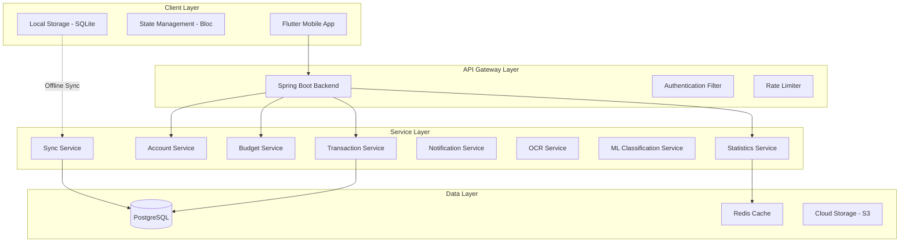
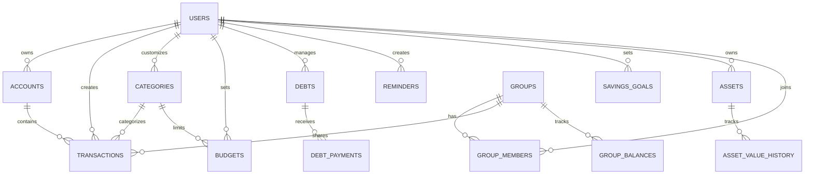

# Thiết Kế - Kiến Trúc Chung

## Tổng Quan Kiến Trúc

Hệ thống sử dụng kiến trúc Client-Server ba tầng:

- **Frontend**: Ứng dụng di động Flutter hỗ trợ đa nền tảng (iOS, Android)
- **Backend**: RESTful API xây dựng bằng Spring Boot với Java
- **Database**: PostgreSQL làm cơ sở dữ liệu quan hệ chính



## Cấu Trúc Backend (Spring Boot)

```
com.expensemanager/
├── config/
│   ├── SecurityConfig.java
│   ├── DatabaseConfig.java
│   └── RedisConfig.java
├── controller/
├── service/
├── repository/
├── model/
│   ├── entity/
│   └── dto/
├── security/
│   ├── JwtTokenProvider.java
│   └── JwtAuthenticationFilter.java
└── exception/
    └── GlobalExceptionHandler.java
```

## Cấu Trúc Flutter App

```
lib/
├── core/
│   ├── constants/
│   ├── utils/
│   ├── network/
│   └── storage/
├── data/
│   ├── models/
│   ├── repositories/
│   └── datasources/
│       ├── local/
│       └── remote/
├── domain/
│   ├── entities/
│   ├── repositories/
│   └── usecases/
├── presentation/
│   ├── screens/
│   ├── widgets/
│   └── bloc/
└── main.dart
```

## Database Schema

### Users Table

```sql
CREATE TABLE users (
    id BIGSERIAL PRIMARY KEY,
    email VARCHAR(255) UNIQUE NOT NULL,
    password_hash VARCHAR(255) NOT NULL,
    full_name VARCHAR(255),
    phone VARCHAR(20),
    avatar_url TEXT,
    language VARCHAR(10) DEFAULT 'vi',
    currency VARCHAR(10) DEFAULT 'VND',
    theme VARCHAR(20) DEFAULT 'light',
    week_start_day VARCHAR(10) DEFAULT 'monday',
    date_format VARCHAR(20) DEFAULT 'DD/MM/YYYY',
    biometric_enabled BOOLEAN DEFAULT FALSE,
    auto_backup_enabled BOOLEAN DEFAULT FALSE,
    auto_classification_enabled BOOLEAN DEFAULT TRUE,
    created_at TIMESTAMP DEFAULT CURRENT_TIMESTAMP,
    updated_at TIMESTAMP DEFAULT CURRENT_TIMESTAMP,
    deleted_at TIMESTAMP,
    version INTEGER DEFAULT 1
);
CREATE INDEX idx_users_email ON users(email);
CREATE INDEX idx_users_deleted_at ON users(deleted_at);
```

### Accounts Table

```sql
CREATE TABLE accounts (
    id BIGSERIAL PRIMARY KEY,
    user_id BIGINT NOT NULL REFERENCES users(id),
    name VARCHAR(255) NOT NULL,
    type VARCHAR(50) NOT NULL, -- 'wallet', 'bank', 'savings_account', 'credit_card'
    initial_balance DECIMAL(15, 2) DEFAULT 0,
    current_balance DECIMAL(15, 2) DEFAULT 0,
    icon VARCHAR(100),
    color VARCHAR(20),
    display_order INTEGER DEFAULT 0,
    interest_rate DECIMAL(5, 2),
    expected_withdrawal_date DATE,
    credit_limit DECIMAL(15, 2),
    current_debt DECIMAL(15, 2) DEFAULT 0,
    payment_due_date DATE,
    created_at TIMESTAMP DEFAULT CURRENT_TIMESTAMP,
    updated_at TIMESTAMP DEFAULT CURRENT_TIMESTAMP,
    deleted_at TIMESTAMP,
    version INTEGER DEFAULT 1
);
CREATE INDEX idx_accounts_user_id ON accounts(user_id);
CREATE INDEX idx_accounts_type ON accounts(type);
CREATE INDEX idx_accounts_payment_due_date ON accounts(payment_due_date);
CREATE INDEX idx_accounts_deleted_at ON accounts(deleted_at);
```

### Categories Table

```sql
CREATE TABLE categories (
    id BIGSERIAL PRIMARY KEY,
    user_id BIGINT REFERENCES users(id),
    name VARCHAR(255) NOT NULL,
    type VARCHAR(20) NOT NULL, -- 'income', 'expense'
    icon VARCHAR(100),
    color VARCHAR(20),
    is_default BOOLEAN DEFAULT FALSE,
    display_order INTEGER DEFAULT 0,
    created_at TIMESTAMP DEFAULT CURRENT_TIMESTAMP,
    updated_at TIMESTAMP DEFAULT CURRENT_TIMESTAMP,
    deleted_at TIMESTAMP,
    version INTEGER DEFAULT 1
);
CREATE INDEX idx_categories_user_id ON categories(user_id);
CREATE INDEX idx_categories_type ON categories(type);
CREATE INDEX idx_categories_deleted_at ON categories(deleted_at);
```

### Transactions Table

```sql
CREATE TABLE transactions (
    id BIGSERIAL PRIMARY KEY,
    user_id BIGINT NOT NULL REFERENCES users(id),
    account_id BIGINT NOT NULL REFERENCES accounts(id),
    category_id BIGINT NOT NULL REFERENCES categories(id),
    amount DECIMAL(15, 2) NOT NULL,
    type VARCHAR(20) NOT NULL, -- 'income', 'expense'
    transaction_date TIMESTAMP NOT NULL,
    note TEXT,
    image_url TEXT,
    group_id BIGINT REFERENCES groups(id),
    created_at TIMESTAMP DEFAULT CURRENT_TIMESTAMP,
    updated_at TIMESTAMP DEFAULT CURRENT_TIMESTAMP,
    deleted_at TIMESTAMP,
    version INTEGER DEFAULT 1
);
CREATE INDEX idx_transactions_user_id ON transactions(user_id);
CREATE INDEX idx_transactions_account_id ON transactions(account_id);
CREATE INDEX idx_transactions_category_id ON transactions(category_id);
CREATE INDEX idx_transactions_date ON transactions(transaction_date);
CREATE INDEX idx_transactions_type ON transactions(type);
CREATE INDEX idx_transactions_deleted_at ON transactions(deleted_at);
CREATE INDEX idx_transactions_group_id ON transactions(group_id);
```

### Budgets Table

```sql
CREATE TABLE budgets (
    id BIGSERIAL PRIMARY KEY,
    user_id BIGINT NOT NULL REFERENCES users(id),
    category_id BIGINT NOT NULL REFERENCES categories(id),
    amount DECIMAL(15, 2) NOT NULL,
    period_type VARCHAR(20) NOT NULL, -- 'daily', 'weekly', 'monthly', 'yearly'
    start_date DATE NOT NULL,
    end_date DATE NOT NULL,
    created_at TIMESTAMP DEFAULT CURRENT_TIMESTAMP,
    updated_at TIMESTAMP DEFAULT CURRENT_TIMESTAMP,
    deleted_at TIMESTAMP,
    version INTEGER DEFAULT 1
);
CREATE INDEX idx_budgets_user_id ON budgets(user_id);
CREATE INDEX idx_budgets_category_id ON budgets(category_id);
CREATE INDEX idx_budgets_period ON budgets(start_date, end_date);
CREATE INDEX idx_budgets_deleted_at ON budgets(deleted_at);
```

### Debts Table

```sql
CREATE TABLE debts (
    id BIGSERIAL PRIMARY KEY,
    user_id BIGINT NOT NULL REFERENCES users(id),
    type VARCHAR(20) NOT NULL, -- 'payable', 'receivable'
    person_name VARCHAR(255) NOT NULL,
    total_amount DECIMAL(15, 2) NOT NULL,
    remaining_amount DECIMAL(15, 2) NOT NULL,
    interest_rate DECIMAL(5, 2) DEFAULT 0,
    due_date DATE,
    status VARCHAR(20) DEFAULT 'active',
    note TEXT,
    created_at TIMESTAMP DEFAULT CURRENT_TIMESTAMP,
    updated_at TIMESTAMP DEFAULT CURRENT_TIMESTAMP,
    deleted_at TIMESTAMP,
    version INTEGER DEFAULT 1
);
CREATE INDEX idx_debts_user_id ON debts(user_id);
CREATE INDEX idx_debts_due_date ON debts(due_date);
CREATE INDEX idx_debts_deleted_at ON debts(deleted_at);
```

### Debt Payments Table

```sql
CREATE TABLE debt_payments (
    id BIGSERIAL PRIMARY KEY,
    debt_id BIGINT NOT NULL REFERENCES debts(id),
    amount DECIMAL(15, 2) NOT NULL,
    payment_date TIMESTAMP NOT NULL,
    note TEXT,
    created_at TIMESTAMP DEFAULT CURRENT_TIMESTAMP
);
CREATE INDEX idx_debt_payments_debt_id ON debt_payments(debt_id);
```

### Reminders Table

```sql
CREATE TABLE reminders (
    id BIGSERIAL PRIMARY KEY,
    user_id BIGINT NOT NULL REFERENCES users(id),
    title VARCHAR(255) NOT NULL,
    amount DECIMAL(15, 2),
    frequency VARCHAR(20) NOT NULL, -- 'daily', 'weekly', 'monthly', 'yearly'
    reminder_time TIME NOT NULL,
    next_reminder_date DATE NOT NULL,
    is_active BOOLEAN DEFAULT TRUE,
    created_at TIMESTAMP DEFAULT CURRENT_TIMESTAMP,
    updated_at TIMESTAMP DEFAULT CURRENT_TIMESTAMP,
    deleted_at TIMESTAMP,
    version INTEGER DEFAULT 1
);
CREATE INDEX idx_reminders_user_id ON reminders(user_id);
CREATE INDEX idx_reminders_next_date ON reminders(next_reminder_date);
CREATE INDEX idx_reminders_active ON reminders(is_active);
CREATE INDEX idx_reminders_deleted_at ON reminders(deleted_at);
```

### Groups Table

```sql
CREATE TABLE groups (
    id BIGSERIAL PRIMARY KEY,
    name VARCHAR(255) NOT NULL,
    description TEXT,
    invite_code VARCHAR(50) UNIQUE,
    created_by BIGINT NOT NULL REFERENCES users(id),
    created_at TIMESTAMP DEFAULT CURRENT_TIMESTAMP,
    updated_at TIMESTAMP DEFAULT CURRENT_TIMESTAMP,
    deleted_at TIMESTAMP,
    version INTEGER DEFAULT 1
);
CREATE INDEX idx_groups_invite_code ON groups(invite_code);
CREATE INDEX idx_groups_created_by ON groups(created_by);
CREATE INDEX idx_groups_deleted_at ON groups(deleted_at);
```

### Group Members Table

```sql
CREATE TABLE group_members (
    id BIGSERIAL PRIMARY KEY,
    group_id BIGINT NOT NULL REFERENCES groups(id),
    user_id BIGINT NOT NULL REFERENCES users(id),
    role VARCHAR(20) DEFAULT 'member',
    joined_at TIMESTAMP DEFAULT CURRENT_TIMESTAMP,
    UNIQUE(group_id, user_id)
);
CREATE INDEX idx_group_members_group_id ON group_members(group_id);
CREATE INDEX idx_group_members_user_id ON group_members(user_id);
```

### Group Balances Table

```sql
CREATE TABLE group_balances (
    id BIGSERIAL PRIMARY KEY,
    group_id BIGINT NOT NULL REFERENCES groups(id),
    user_id BIGINT NOT NULL REFERENCES users(id),
    balance DECIMAL(15, 2) DEFAULT 0,
    updated_at TIMESTAMP DEFAULT CURRENT_TIMESTAMP,
    UNIQUE(group_id, user_id)
);
CREATE INDEX idx_group_balances_group_id ON group_balances(group_id);
```

### Savings Goals Table

```sql
CREATE TABLE savings_goals (
    id BIGSERIAL PRIMARY KEY,
    user_id BIGINT NOT NULL REFERENCES users(id),
    name VARCHAR(255) NOT NULL,
    target_amount DECIMAL(15, 2) NOT NULL,
    current_amount DECIMAL(15, 2) DEFAULT 0,
    deadline DATE,
    image_url TEXT,
    status VARCHAR(20) DEFAULT 'active',
    created_at TIMESTAMP DEFAULT CURRENT_TIMESTAMP,
    updated_at TIMESTAMP DEFAULT CURRENT_TIMESTAMP,
    deleted_at TIMESTAMP,
    version INTEGER DEFAULT 1
);
CREATE INDEX idx_savings_goals_user_id ON savings_goals(user_id);
CREATE INDEX idx_savings_goals_status ON savings_goals(status);
CREATE INDEX idx_savings_goals_deleted_at ON savings_goals(deleted_at);
```

### Assets Table

```sql
CREATE TABLE assets (
    id BIGSERIAL PRIMARY KEY,
    user_id BIGINT NOT NULL REFERENCES users(id),
    name VARCHAR(255) NOT NULL,
    type VARCHAR(50) NOT NULL, -- 'real_estate', 'vehicle', 'investment', 'other'
    current_value DECIMAL(15, 2) NOT NULL,
    purchase_date DATE,
    note TEXT,
    created_at TIMESTAMP DEFAULT CURRENT_TIMESTAMP,
    updated_at TIMESTAMP DEFAULT CURRENT_TIMESTAMP,
    deleted_at TIMESTAMP,
    version INTEGER DEFAULT 1
);
CREATE INDEX idx_assets_user_id ON assets(user_id);
CREATE INDEX idx_assets_type ON assets(type);
CREATE INDEX idx_assets_deleted_at ON assets(deleted_at);
```

### Asset Value History Table

```sql
CREATE TABLE asset_value_history (
    id BIGSERIAL PRIMARY KEY,
    asset_id BIGINT NOT NULL REFERENCES assets(id),
    value DECIMAL(15, 2) NOT NULL,
    recorded_at TIMESTAMP DEFAULT CURRENT_TIMESTAMP
);
CREATE INDEX idx_asset_value_history_asset_id ON asset_value_history(asset_id);
```

### Reports Table

```sql
CREATE TABLE reports (
    id BIGSERIAL PRIMARY KEY,
    user_id BIGINT NOT NULL REFERENCES users(id),
    type VARCHAR(20) NOT NULL, -- 'pdf', 'excel'
    start_date DATE NOT NULL,
    end_date DATE NOT NULL,
    file_url TEXT,
    status VARCHAR(20) DEFAULT 'pending',
    created_at TIMESTAMP DEFAULT CURRENT_TIMESTAMP,
    expires_at TIMESTAMP
);
CREATE INDEX idx_reports_user_id ON reports(user_id);
CREATE INDEX idx_reports_expires_at ON reports(expires_at);
```

### ML Classification Models Table

```sql
CREATE TABLE ml_classification_models (
    id BIGSERIAL PRIMARY KEY,
    user_id BIGINT NOT NULL REFERENCES users(id),
    model_data BYTEA,
    accuracy DECIMAL(5, 2),
    last_trained_at TIMESTAMP,
    created_at TIMESTAMP DEFAULT CURRENT_TIMESTAMP,
    updated_at TIMESTAMP DEFAULT CURRENT_TIMESTAMP
);
CREATE INDEX idx_ml_models_user_id ON ml_classification_models(user_id);
```

### Backups Table

```sql
CREATE TABLE backups (
    id BIGSERIAL PRIMARY KEY,
    user_id BIGINT NOT NULL REFERENCES users(id),
    file_url TEXT NOT NULL,
    file_size BIGINT,
    backup_type VARCHAR(20) DEFAULT 'manual',
    created_at TIMESTAMP DEFAULT CURRENT_TIMESTAMP,
    expires_at TIMESTAMP
);
CREATE INDEX idx_backups_user_id ON backups(user_id);
CREATE INDEX idx_backups_created_at ON backups(created_at);
```

## Entity Relationships



## Quyết Định Thiết Kế

1. **Soft Delete**: Dùng `deleted_at` thay vì xóa vật lý để giữ lịch sử
2. **Versioning**: Cột `version` cho optimistic locking và conflict resolution
3. **Decimal Type**: `DECIMAL(15,2)` cho số tiền để tránh lỗi làm tròn
4. **Nullable Fields**: Các trường đặc thù theo loại account để nullable, validation ở application layer
5. **Offline-first**: Flutter app lưu local trước, sync sau

## API Response Chuẩn

```json
// Success
{ "data": {}, "message": "Success" }

// Error
{ "status": 400, "message": "Lỗi validation", "timestamp": "2024-01-01T00:00:00" }

// Pagination
{ "data": [], "page": 0, "size": 20, "total": 100, "totalPages": 5 }
```
